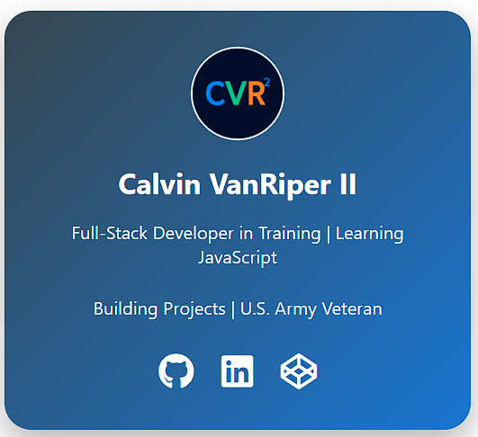
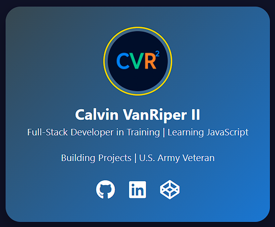

## Hi there 👋 I'm Calvin VanRiper

### Full-Stack Developer in Training | Automation Engineer | U.S. Army Veteran

I'm transitioning from 15+ years of technical leadership and systems operations in the U.S. Army into a career in **software engineering**. I'm passionate about building scalable applications, automating processes, and solving complex problems with clean, efficient code.

Currently, I'm focused on developing real-world projects using modern web technologies while pursuing a long-term path toward becoming a **Full-Stack Developer**.

---

## 🚀 Tech Stack I'm Learning & Using

### **Languages**
- Javascript
- Python
- SQL
- Bash/Shell
- Java (currently learning fundamentals)

### **Front-End**
- HTML5
- CSS3
- Javascript (DOM, ES6+)
- React (coming soon)

### **Back-End**
- Node.js
- Express.js
- REST APIs
- Linux / Command Line

### **Tools and Platforms**
- Git & GitHub
- CodePen
- VS Code

---

## 📚 Current Learning Roadmap

### Full-Stack Foundations
- freeCodeCamp (Certified Full Stack Developer Curriculum)
- LinkedIn Learning (Become a Full-Stack Web Developer)
- Coursera (Google IT Automation with Python - Professional Certificate)

---

## 🛠️ Projects (More Coming Soon!)

### 🎨 CodePen Projects
Here are a few interactive UI/Animation experiments I've built on CodePen:

  
  &nbsp;&nbsp;
  

*(More coming soon! Click any link to open the live demo.)*

### 🔧 **JavaScript Mini-Projects**
Interactive front-end components and small utilities to build core skills.

### 📊 **Automation Tools**
Scripts and small services that improve workflows and save time.

### 🌐 **Full-Stack Applications**
Larger, portfolio-ready applications as I progress through LinkedIn Learning, freeCodeCamp, and Coursera.

---

## 🏆 Experience Highlights

- 15+ years of leadership, operations, and systems oversight in the U.S. Army
- Strong background in **technical training**, **process improvement**, and **problem-solving**
- Experienced in high-stakes environments requiring reliability, precision, and teamwork
- Now applying those skills to engineering software systems that are scalable and efficient

---

## 🌎 Connect With Me

- **LinkedIn:** https://www.linkedin.com/in/calvinvanriper
- **CodePen:** https://codepen.io/calvinvanriper
- **Email:**
- **Portfolio:** (coming soon)

---

## ⚡ Fun Fact
I love building tools that automate tasks and make systems run more smoothly - whether it's in code, infrastructure, or processes.

---

### Thanks for visiting - feel free to check out my repositories or connect with me!
<!--
**calvinvanriper/calvinvanriper** is a ✨ _special_ ✨ repository because its `README.md` (this file) appears on your GitHub profile.

Here are some ideas to get you started:

- 🔭 I’m currently working on ...
- 🌱 I’m currently learning ...
- 👯 I’m looking to collaborate on ...
- 🤔 I’m looking for help with ...
- 💬 Ask me about ...
- 📫 How to reach me: ...
- 😄 Pronouns: ...
- ⚡ Fun fact: ...
-->
